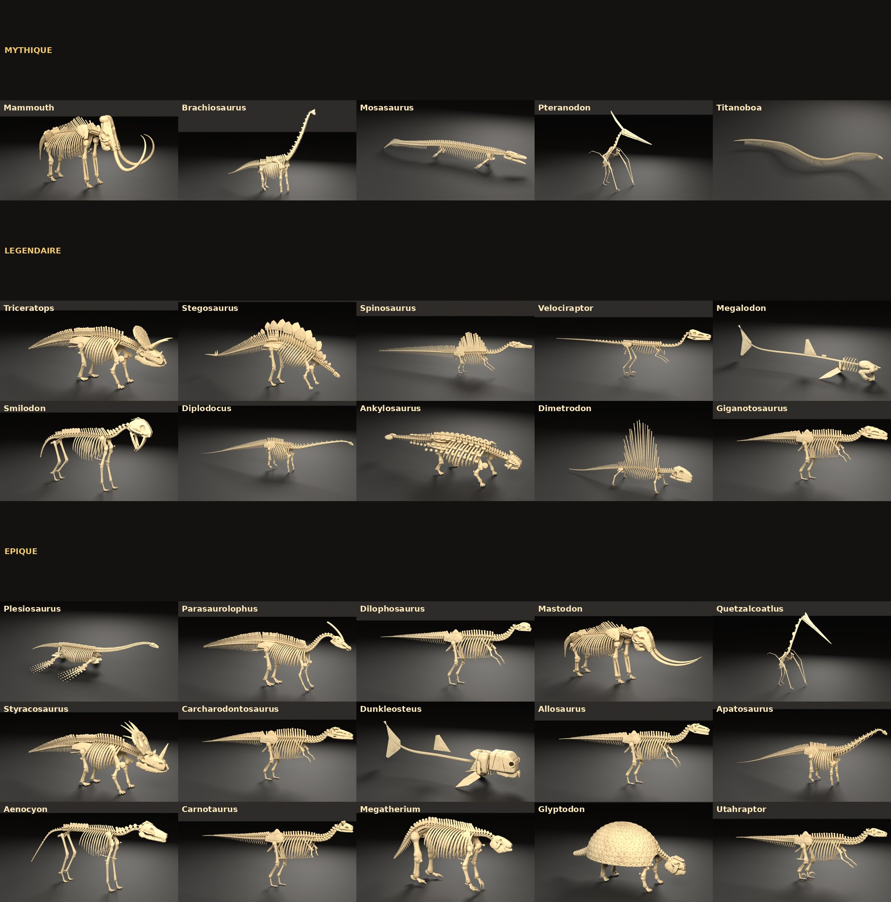
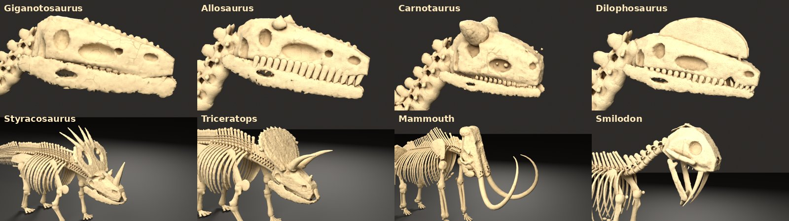
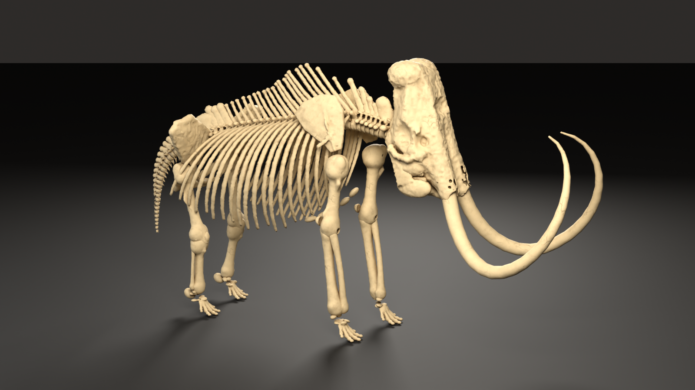
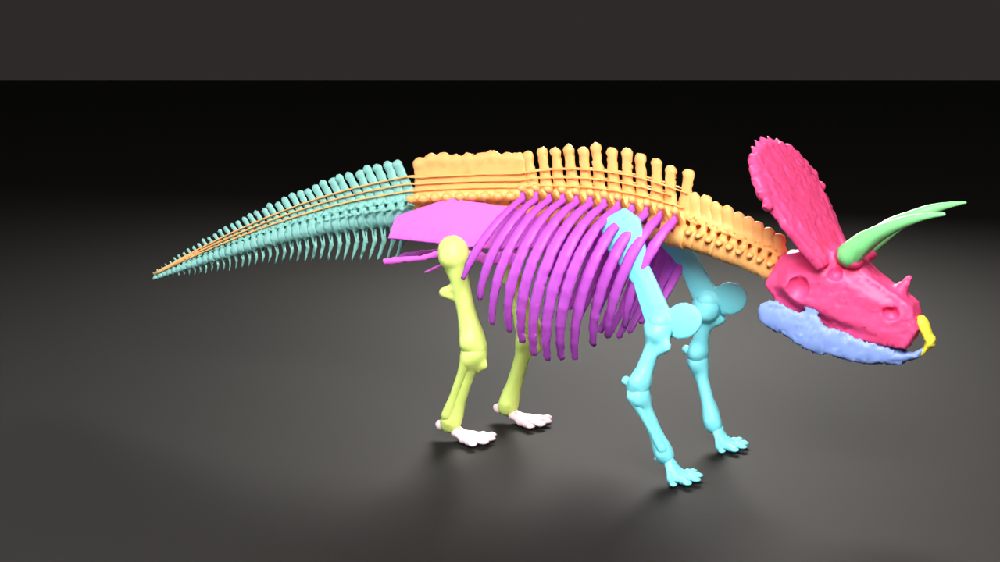
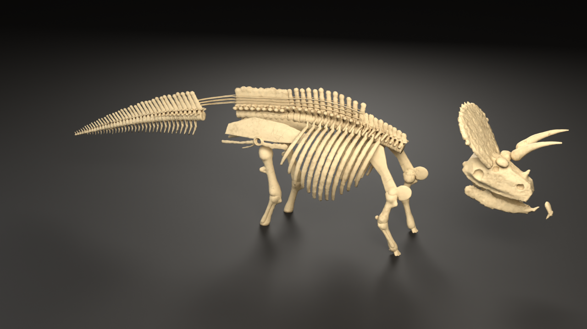

# GUIDE — Squelettes « Le Dinosaure » (Roblox) : tout refaire à l'identique, puis mieux

Ce dossier explique **quoi**, **comment** et **pourquoi**, pour qu'un autre modèle (ou toi) puisse
reconstruire exactement les 30 squelettes, les découper en pièces du catalogue et les améliorer.
Le code est la recette exacte : ce guide dit comment s'en servir et quelles règles ne jamais casser.



---

## 1. Ce qui est demandé (règles non négociables)

| Règle | Détail |
|---|---|
| Réalisme « scan de musée » | Os ivoire fossile (≈ `#E6D5B0`, teinte légèrement propre à chaque espèce), pores, fissures fines, rugosité variable, jamais d'aspect cube/low-poly. Référence de style : `references/Espece_Triceratops_REFERENCE_utilisateur.blend`. |
| Anatomie propre à chaque espèce | Jamais un squelette générique avec une autre tête. Crâne, dents, cornes, crêtes, proportions et nombre de vertèbres propres à l'espèce (voir fiches des catalogues `references/*.pdf`). |
| **Découpage = le vrai squelette coupé en N pièces** | Chaque espèce a N pièces, **N dépend de la rareté et se lit dans le catalogue** (Mythique 12, Légendaire 11, Épique 10, puis Rare et les suivants **moins** — voir §5 « Moins de pièces »). **Tous** les os du squelette complet sont répartis dans ces N pièces ; remises ensemble elles reforment **tout** le squelette, à sa place et à sa taille. ❌ Ne PAS faire « 1 pièce = 1 os isolé » (c'était l'erreur initiale : pièces « mini » qui ne correspondent à rien). |
| Nom des pièces | `Os_<Pièce>_<Clé>` (clé = « clé jeu » du catalogue, ex. `Os_Crane_Triceratops`, `Os_Branchie_Dunkleosteus`). Dans Blender : `Os_<Pièce>_<Clé>_01`. |
| Échelle | 1 unité = 1 stud, **taille réelle relative entre espèces**. On modélise en mètres puis ×`UNITS_PER_METRE = 4.72` (valeur mesurée sur le blend de référence). Squelette posé au sol (z = 0). |
| Budgets triangles | Squelette LOD0 : petit 20–60 k, moyen 40–100 k, très grand 60–150 k. LOD1 ≈ 50 %, LOD2 ≈ 22 %. **Chaque pièce ≤ 19 500 triangles** (limite Roblox 20 k par MeshPart). |
| Hiérarchie | Collections `SKELETON_<CLÉ>` → `SKULL`, `SPINE`, `RIBCAGE`, `PELVIS`, `FRONT_LIMBS`, `HIND_LIMBS`, `SPECIAL_FEATURES` (sous-collections `_L/_R`) ; os nommés `PRÉFIXE_os_côté` (ex. `TRIC_femur_L`). |
| Studio | Lumières Key (1100 W chaude) / Fill (260 W froide) / Rim (900 W), sol sombre, Cycles, vue Standard « Medium High Contrast ». |
| Exports | FBX / GLB / OBJ du squelette entier + FBX de chaque pièce + FBX des pièces assemblées. |
| Pose | Pose de musée naturelle (théropodes en marche, quadrupèdes debout, marins en nage). |

---

## 2. Installation et commandes

```bash
bash blender/GUIDE/setup.sh                     # venv Python 3.13 + bpy 5.2.2 + scikit-image + scipy
cd blender
/opt/b52/bin/python build.py triceratops         # build complet (~15–30 min CPU 4 cœurs) + découpage auto
/opt/b52/bin/python build.py triceratops --quick --no-export   # aperçu rapide (~5 min) pour vérifier
/opt/b52/bin/python repartition.py Triceratops   # refaire SEULEMENT le découpage en pièces (clé avec majuscule)
/opt/b52/bin/python vue_decoupage.py Triceratops # ré-appliquer l'affichage 1 couleur / pièce dans le .blend
```

- Seul **Cycles** marche sans écran (pas d'EEVEE/Workbench headless).
- `module` = nom du fichier dans `species/` (minuscules) ; `Clé` = `SPEC['key']` (majuscule), c'est le nom des dossiers `out/<Clé>` et `renders/<Clé>`.
- **Parallélisation** : `build.py` utilise déjà tous les cœurs pour le maillage. Pour aller vite, lancer **une espèce par machine** (5 machines = 5 espèces en même temps). Un build complet ≈ 15–30 min sur 4 cœurs ; plus de cœurs = plus rapide. Pas besoin de GPU.

### Sorties par espèce
```
out/<Clé>/Espece_<Clé>.blend          fichier Blender : pièces visibles (1 couleur/pièce), squelette os-par-os caché, LOD exclus
out/<Clé>/pieces_layout.json          centre de chaque pièce en studs + triangles + nb d'os (pour réassembler en jeu)
out/<Clé>/export/Os_<Pièce>_<Clé>.fbx  une pièce, origine au centre de la pièce
out/<Clé>/export/Squelette_<Clé>_Pieces.fbx   toutes les pièces assemblées
out/<Clé>/export/Squelette_<Clé>.{fbx,glb,obj} squelette entier os par os
renders/<Clé>/<Clé>_34.png, _side.png, _skull.png (+ gros plans), _pieces_assemblees.png, _pieces.png (vue éclatée)
```

---

## 3. Architecture du code (`blender/`)

| Fichier | Rôle |
|---|---|
| `lib/sdf.py` | Modélisation par **champs de distance (SDF)** en numpy : `sphere, ellipsoid, box, round_cone, tube, ribbon` (bande épaisse le long d'une courbe), `plate` (polygone 2D extrudé avec épaisseur centre→bord), `bezier`, `mirror_y`, `custom` ; opérations `union(k)` lisse, `.sub`, `.inter`, `.grow`, `.displace` (bruit fbm), `.detail` (micro-relief « ridged » façon scan) ; `mesh()` = marching cubes (grille ≤ 400³). |
| `lib/anat.py` | Générateurs d'os paramétriques : `vertebra` (centrum, arc, épine, apophyses, zygapophyses, chevrons, pleurocœles…), `rib` (tête double + corps courbé), `long_bone` (fémur/humérus… têtes, condyles, crêtes, courbure), `digit` (phalanges + griffe/sabot), `carpal_block`, `local()` (repère). `anat.DETAIL` règle le micro-relief par espèce. |
| `lib/plans.py` | Briques de squelette : `Curve3` (spline de la colonne), `column()` (place une série de vertèbres le long de la courbe en ajustant les longueurs), `ribcage`, `gastralia`, `tendons` ossifiés, bassins `pelvis_saurischian` / `pelvis_ornithischian`, `skull_shell` (crâne par profil sagittal + fenêtres percées), dents `blade_tooth`/`cone_tooth`/`tooth_row` (instanciées), `theropod_leg` (option griffe en faucille), `theropod_arm` (griffe séparable), `quad_limb`, `hoofed_foot`, `claw_shape`. |
| `lib/theropod.py` | Corps de théropode bipède piloté par un dictionnaire `CFG`. |
| `lib/thero_scale.py` | Kit de proportions de grand théropode mesuré sur 12,5 m, remis à l'échelle (`s = longueur/12.5`) avec réglages (hauteur de hanche, cou, bras, épines, « ailes » caudales). |
| `lib/ornitho.py` | Corps d'ornithischien quadrupède (cératopsiens, stégosaures, ankylosaures, hadrosaures). |
| `lib/mammal.py` | Corps de mammifère quadrupède (loup, paresseux géant, glyptodon) : `os_coxae`, `paw`… |
| `lib/bl.py` | Blender : scène, collections, création des maillages, **décimation au budget**, échelle, origine, **matériau os procédural**, studio 3 lumières, caméra auto-cadrée, rendu, `joined_copy`, exports, `show_pieces` (1 couleur/pièce). |
| `species/<espece>.py` | **Une espèce = un fichier** : docstring (silhouette à respecter, tirée de la fiche), `SPEC` (clé, budget, couleurs, gros plans, vues) + `bones()` qui renvoie la liste des os (nom, collection, forme SDF, voxel, poids de budget). |
| `build.py` | Pipeline complet d'une espèce (voir §4). |
| `partition.py` | **Règles de découpage** : pour chaque clé, liste ordonnée `(Pièce, règle)` ; la première règle qui matche le nom de l'os gagne. |
| `repartition.py` | Coupe le squelette construit en pièces (voir §5). |
| `bake.py` | (non encore lancé) cuisson Couleur/Normal/Rugosité par pièce pour Roblox. |

---

## 4. Comment un squelette est construit (`build.py`)

1. `bones()` de l'espèce → liste d'os = formes SDF en **mètres**, X vers l'avant, Y gauche, Z haut.
2. **Maillage parallèle** : chaque os → marching cubes à sa taille de voxel (`pool` multiprocessing).
3. **Instances** : dents et vertèbres répétitives = copies liées (`instance_of`, matrices `M`/`M_src`) → moins de calcul et de mémoire.
4. **Budget triangles** : budget total `SPEC['budget']` réparti selon *surface × nombre d'utilisations × poids* ; `min_tris`/`max_tris` par os ; décimation `DECIMATE` (collapse).
5. **Pose au sol** (zmin → 0), puis mise à l'échelle ×4,72 (studs).
6. LOD1 (50 %) et LOD2 (22 %) joints par région, chacun < 20 k.
7. Studio + rendus (vue 3/4, profil, gros plans) → `.blend` + exports.
8. Si export : lance automatiquement `repartition.py` (découpage en pièces).

### Méthode de design d'une espèce (ce qui fait la qualité)
- **Partir de la fiche** : silhouette, taille réelle, pièces à modéliser, notes (« crâne 1,6 m long et étroit », « griffe 24 cm »…). Les écrire dans la docstring. Mettre les tailles réelles citées (crâne, fémur, griffe) dans le code.
- **Colonne** : spline `spine` du bout du museau à la queue ; séries `(type, nombre, fonction(t,i))` avec le bon nombre de vertèbres. La fonction donne la longueur relative et les paramètres (`cr` rayon du centrum, `sl` hauteur d'épine, `tilt`, `tl` apophyses transverses, `chevron`…) qui évoluent le long de la série.
- **Crâne** : profil sagittal `prof` (u le long du crâne, v vers le haut) extrudé entre `w_back` et `w_front`, fenêtres percées (orbite, antéorbitaire, narine, temporale), puis ajouts propres (cornes, crêtes, bourrelets rugueux) et creusements (palais). Mâchoire séparée, dents en rangées instanciées.
- **Membres** : articulations G/E/W (épaule, coude, poignet) et A/K/Ank (hanche, genou, cheville) placées relativement aux ancres (`sh` épaule, `hip`, `A` acétabulum) ; les os longs relient ces points.
- **Détail scan** : `.displace()` (forme douce) + `.detail(amp, freq)` (micro-relief) ; `anat.DETAIL≈0.8–1.0`.
- Réutiliser les **générateurs** (plans/anat/theropod/ornitho/mammal) est voulu ; réutiliser **l'os d'une autre espèce** est interdit.
- Exemples de dérivation : Apatosaure = plan du Diplodocus + cou massif (côtes cervicales vers le bas, épines en U) + membres plus lourds ; Mastodonte = plan du Mammouth + étirement global (plus long, plus bas) + crâne plat, défenses droites parallèles, molaires à cônes ; Quetzalcoatlus = plan du Ptéranodon + cou tubulaire très long, bec 2,5 m, ×1,75.




---

## 5. Le découpage en pièces (le point le plus important)




- `partition.py` associe **chaque os** à **une** pièce du catalogue par règles sur son nom (sans le préfixe) :
  ```python
  'Triceratops': [('Crane', rx(r'skull')), ('Corne', rx(r'horn_brow_')), ('Bec', rx(r'rostral')),
                  ('Machoire', rx(r'mandible')), ('Vertebre', rx(r'cervical_', r'dorsal_', r'sacrum', r'ossified_tendons')),
                  ('Cote', rx(r'rib_')), ('Omoplate', rx(r'scapula_', r'humerus_', r'radius_', r'ulna_', r'manus_')),
                  ('Bassin', rx(r'pelvis')), ('Femur', rx(r'femur_', r'tibia_', r'fibula_')), ('Pied', rx(r'pes_')),
                  ('Queue', rx(r'caudal_'))],
  ```
- **Principe** : chaque pièce = une région anatomique du vrai squelette. Quand le catalogue n'a pas de pièce pour certains os, on les rattache à la pièce **voisine logique** (ex. pas de « Bras » → bras dans « Omoplate » ou « Griffe » ; pas de « Tibia » → tibia/péroné dans « Fémur » ; pas de « Pied » → pied dans « Fémur » ou « Griffe » (raptors) ; dents du Diplodocus dans « Crâne »). Pour les serpents/poissons, on coupe la colonne par **numéro de vertèbre** (`num(n) <= 172`…).
- `repartition.py <Clé>` : ouvre le `.blend`, groupe les os par pièce, **s'arrête avec `!!` si un os n'a pas de pièce**, joint chaque groupe en `Os_<Pièce>_<Clé>_01` **en place** (même géométrie que le squelette), décime à 19 500 si besoin, écrit `pieces_layout.json`, exporte chaque pièce (origine au centre) + l'assemblage, rend la vue assemblée et éclatée, cache le squelette os-par-os, colore chaque pièce (`bl.show_pieces` : Solid + couleur objet ; le rendu garde l'ivoire).
- **Vérifier la couverture avant un build** (tous les os ont une pièce, aucune pièce vide, bon nombre de pièces) :
  ```python
  # cd blender && python GUIDE/outils/verif_decoupage.py <module> ...   → MISSING [] et EMPTY [] obligatoires
  ```

### Moins de pièces (Rare, Commun… : catalogues suivants)
Plus la rareté baisse, moins il y a de pièces, **mais le squelette reste complet** : on coupe le même squelette
en **moins de morceaux plus gros**. Ne jamais supprimer d'os ni en laisser hors pièce. Méthode :
1. Prendre la liste exacte des pièces dans la fiche (nom et code `Os_…`).
2. Chaque pièce reçoit son os « titre » (Crâne → `skull`, Fémur → `femur_`…).
3. Rattacher tous les autres os à la pièce **voisine anatomique** la plus logique, dans cet ordre de regroupement :
   dents + mâchoire → **Crâne** ; côtes, sternum, gastralia → **Vertèbre** (ou **Côte** si elle existe) ;
   omoplate + bras + main → **Bras** (sinon **Omoplate**, sinon **Côte**) ; tibia/péroné + pied → **Fémur** (sinon **Pied**) ;
   queue → **Queue** (sinon **Vertèbre**) ; cornes/crêtes/plaques → leur pièce si elle existe, sinon **Crâne** / **Vertèbre**.
4. Exemple à 5 pièces (Crâne, Vertèbre, Bras, Fémur, Queue) : Crâne = crâne+mâchoire+dents+cornes ; Vertèbre = cou+dos+sacrum+côtes+sternum ;
   Bras = omoplates+bras+mains ; Fémur = bassin+pattes arrière+pieds ; Queue = caudales.
5. Vérifier : `verif_decoupage.py` → MISSING [] , EMPTY [] , et le nombre de pièces = celui de la fiche.
6. Une grosse pièce peut dépasser 19 500 triangles avant décimation : `repartition.py` la réduit automatiquement ;
   si la qualité baisse trop, baisser le `budget` de l'espèce ou découper la pièce en plusieurs MeshParts du même nom dans Roblox.

### Espèces, modules et pièces
| Clé | module | N | Pièces |
|---|---|---|---|
| Mammouth | `mammouth` | 12 | Dent, Defense, Crane, Machoire, Cote, Omoplate, Bras, Bassin, Femur, Tibia, Pied, Vertebre |
| Brachiosaurus | `brachiosaurus` | 12 | Dent, Crane, Machoire, Vertebre, Cote, Omoplate, Bras, Bassin, Femur, Tibia, Pied, Queue |
| Mosasaurus | `mosasaurus` | 12 | Dent, Crane, Machoire, Carre, Pterygoide, Vertebre, Cote, Omoplate, Nageoire, Bassin, NageoireArriere, Queue |
| Pteranodon | `pteranodon` | 12 | Crane, Crete, Bec, Machoire, Vertebre, Cote, Omoplate, Bras, Aile, Bassin, Femur, Pied |
| Titanoboa | `titanoboa` | 12 | Dent, Crane, Maxillaire, Machoire, Carre, Pterygoide, Atlas, Cervicale, Cote, Vertebre, Caudale, Queue |
| Triceratops | `triceratops` | 11 | Crane, Corne, Bec, Machoire, Vertebre, Cote, Omoplate, Bassin, Femur, Pied, Queue |
| Stegosaurus | `stegosaurus` | 11 | Crane, Plaque, Machoire, Vertebre, Cote, Omoplate, Bras, Bassin, Femur, Pied, Queue |
| Spinosaurus | `spinosaurus` | 11 | Dent, Crane, Machoire, Voile, Vertebre, Cote, Griffe, Bassin, Femur, Pied, Queue |
| Velociraptor | `velociraptor` | 11 | Dent, Crane, Machoire, Vertebre, Cote, Fourchette, Bras, Griffe, Bassin, Femur, Queue |
| Megalodon | `megalodon` | 11 | Dent, Crane, Rostre, Machoire, Branchies, Ecailles, Ceinture, Nageoire, NageoireDorsale, Vertebre, Queue |
| Smilodon | `smilodon` | 11 | Dent, Crane, Machoire, Vertebre, Cote, Omoplate, Bras, Griffe, Bassin, Femur, Pied |
| Diplodocus | `diplodocus` | 11 | Crane, Machoire, Vertebre, Cote, Omoplate, Bras, Bassin, Femur, Tibia, Pied, Queue |
| Ankylosaurus | `ankylosaurus` | 11 | Crane, Machoire, Plaque, Massue, Vertebre, Cote, Bras, Bassin, Femur, Pied, Queue |
| Dimetrodon | `dimetrodon` | 11 | Dent, Crane, Machoire, Voile, Vertebre, Cote, Omoplate, Bras, Bassin, Femur, Queue |
| Giganotosaurus | `giganotosaurus` | 11 | Dent, Crane, Machoire, Vertebre, Cote, Griffe, Bras, Bassin, Femur, Pied, Queue |
| Plesiosaurus | `plesiosaurus` | 10 | Dent, Crane, Machoire, Vertebre, Cote, Omoplate, Nageoire, Bassin, NageoireArriere, Queue |
| Parasaurolophus | `parasaurolophus` | 10 | Crane, Crete, Bec, Machoire, Vertebre, Cote, Bassin, Femur, Pied, Queue |
| Dilophosaurus | `dilophosaurus` | 10 | Dent, Crane, Crete, Machoire, Vertebre, Cote, Griffe, Bassin, Femur, Queue |
| Mastodon | `mastodon` | 10 | Dent, Defense, Crane, Machoire, Cote, Bras, Bassin, Femur, Pied, Vertebre |
| Quetzalcoatlus | `quetzalcoatlus` | 10 | Crane, Bec, Vertebre, Cote, Bras, Aile, Bassin, Femur, Tibia, Pied |
| Styracosaurus | `styracosaurus` | 10 | Crane, Corne, Collerette, Bec, Vertebre, Cote, Bassin, Femur, Pied, Queue |
| Carcharodontosaurus | `carcharodontosaurus` | 10 | Dent, Crane, Machoire, Vertebre, Cote, Bras, Bassin, Femur, Pied, Queue |
| Dunkleosteus | `dunkleosteus` | 10 | Dent, Crane, Machoire, Branchie, Plaque, Ceinture, Nageoire, NageoireDorsale, Vertebre, Queue |
| Allosaurus | `allosaurus` | 10 | Dent, Crane, Machoire, Vertebre, Cote, Griffe, Bras, Bassin, Femur, Queue |
| Apatosaurus | `apatosaurus` | 10 | Crane, Machoire, Vertebre, Cote, Omoplate, Bras, Bassin, Femur, Pied, Queue |
| Aenocyon | `aenocyon` | 10 | Dent, Crane, Machoire, Vertebre, Cote, Omoplate, Bras, Bassin, Femur, Pied |
| Carnotaurus | `carnotaurus` | 10 | Dent, Crane, Corne, Machoire, Vertebre, Cote, Bras, Bassin, Femur, Queue |
| Megatherium | `megatherium` | 10 | Dent, Crane, Machoire, Vertebre, Cote, Griffe, Bras, Bassin, Femur, Queue |
| Glyptodon | `glyptodon` | 10 | Dent, Crane, Machoire, Vertebre, Carapace, Bras, Bassin, Femur, Pied, Queue |
| Utahraptor | `utahraptor` | 10 | Dent, Crane, Machoire, Vertebre, Cote, Bras, Griffe, Bassin, Femur, Queue |

---

## 6. Ajouter une nouvelle espèce (procédure exacte)

1. Lire la fiche (PDF : les pages espèces sont des **images** → extraire avec `pypdf` `page.images`, recadrer en-tête + cartes d'os). Noter : clé jeu, taille réelle, silhouette, pièces et leur code `Os_…`.
2. Copier le fichier espèce le plus proche (théropode → `allosaurus.py` ; cératopsien → `styracosaurus.py` ; sauropode → `apatosaurus.py` ; mammifère → `aenocyon.py`/`megatherium.py` ; marin → `plesiosaurus.py`/`dunkleosteus.py` ; ptérosaure → `quetzalcoatlus.py`).
3. Réécrire : docstring, `P` (préfixe 4 lettres), `SPEC` (clé, budget selon la taille, couleur `base`), crâne + traits propres, proportions, nombre de vertèbres.
4. Ajouter la règle dans `partition.py` et vérifier la couverture (0 os sans pièce, 0 pièce vide, N pièces).
5. Test d'erreurs rapide : évaluer chaque SDF sur 64 points (`s(P)` fini) — `cd blender && python GUIDE/outils/verif_os.py <module>` → « errors 0 ».
6. `build.py <module> --quick --no-export` → **regarder les rendus** (3/4, profil, crâne) et corriger.
7. `build.py <module>` complet → vérifier « done », pas de `!!`/`Traceback`, lignes `Os_…` ≤ 19 500 → commit.

### Checklist visuelle (défauts réellement rencontrés et corrigés)
- Pieds qui **flottent** / pattes avant plus hautes que les arrière → comparer `shape.lo[2]` de `manus`/`pes` (doivent être ≈ égaux), allonger le membre ou baisser la cheville.
- **Bras trop longs** (facteur de longueur appliqué deux fois) ; **cou trop long** façon sauropode sur un théropode.
- **Dents cachées** par la mandibule ou qui la traversent → entrouvrir la mâchoire, décaler la rangée vers l'extérieur.
- Crête / collerette en **bloc** au lieu d'une lame fine → contour en arc à 15–17 points, épaisseur faible.
- Formes **boules** là où la fiche montre de l'anguleux (armure du Dunkleosteus) → `box(..., rnd)` creusé par `.grow(-épaisseur)`.
- Petits éléments **détachés** (phalanges en points) → rayon assez grand pour qu'ils se touchent.
- Ruban orienté à plat (crête sagittale en « tige ») → la direction de largeur `wdir` doit être verticale.
- Relief trop discret (rosettes du Glyptodon) → augmenter l'amplitude (0,02 m pour ~7 cm de cellule).

---

## 7. Pièges techniques (déjà résolus dans le code)
- `Mesh.transform` avec une liste = colonne-major → utiliser `mathutils.Matrix.Translation/Scale` (sinon os « explosés »).
- Sockets des nœuds Mix : chercher par nom (`sock()`), pas par index.
- Bassin mal placé → ancres **relatives** (`A_rel` depuis le sacrum).
- `column()` ajuste les longueurs à la courbe : si le cou « déborde », c'est la courbe qu'il faut changer.
- Les champs non uniformes (`stretch`) restent valides pour le maillage ; l'échelle uniforme (`scaled`) est exacte.
- Rendus des pièces : 1280×720, 16 échantillons (sinon ~5 min par espèce).
- Le matériau procédural **ne s'exporte pas** en FBX/GLB → il faut cuire des textures (`bake.py`) pour Roblox.
- Dans une boucle d'attente shell, `pgrep -f "build.py X"` se trouve lui-même → attendre sur le log (`grep "done in"`).

---

## 8. Ce qui reste à améliorer (pour faire « mieux »)
1. **Cuisson des textures** (Couleur/Normal/Rugosité) par pièce → `bake.py` écrit mais jamais lancé ; nécessaire pour voir l'ivoire dans Roblox.
2. Petits défauts restants : pattes avant du Parasaurolophus un peu hautes, nageoires avant du Plésiosaure partiellement sous le corps, pied arrière du Glyptodon légèrement levé, avant du crâne du Mammouth à retravailler, crâne du Dimétrodon un peu carré.
3. Plus de détail scan sur les crânes (sutures, foramens), plus de triangles là où ça se voit (crânes) si le budget le permet.
4. Pièces très chargées (Vertebre/Cote/Queue plafonnées à 19 500) : si besoin de plus de finesse, scinder en sous-maillages sous la même pièce Roblox.

---

## 9. Prompt prêt à donner à un autre modèle
> Tu reprends le projet `blender/` de ce dépôt (squelettes de musée procéduraux pour le jeu Roblox « Le Dinosaure »). Lis d'abord `blender/GUIDE/README.md` en entier, puis les catalogues `blender/GUIDE/references/*.pdf`. Installe l'environnement avec `bash blender/GUIDE/setup.sh`. Respecte strictement les règles du §1 : réalisme scan de musée ivoire, anatomie propre à chaque espèce, **squelette complet découpé en N pièces du catalogue (pas des os isolés) — N se lit dans la fiche et diminue avec la rareté (Rare et suivants : moins de pièces, plus grosses, squelette toujours complet, voir §5)**, noms `Os_<Pièce>_<Clé>`, 1 unité = 1 stud (×4,72), pièces ≤ 19 500 triangles. Pour chaque nouvelle espèce, suis la procédure du §6 et la checklist visuelle ; regarde toujours les rendus avant de valider. Tâche : [décrire ici, ex. « fais le catalogue suivant » ou « cuis les textures des pièces pour Roblox »].
